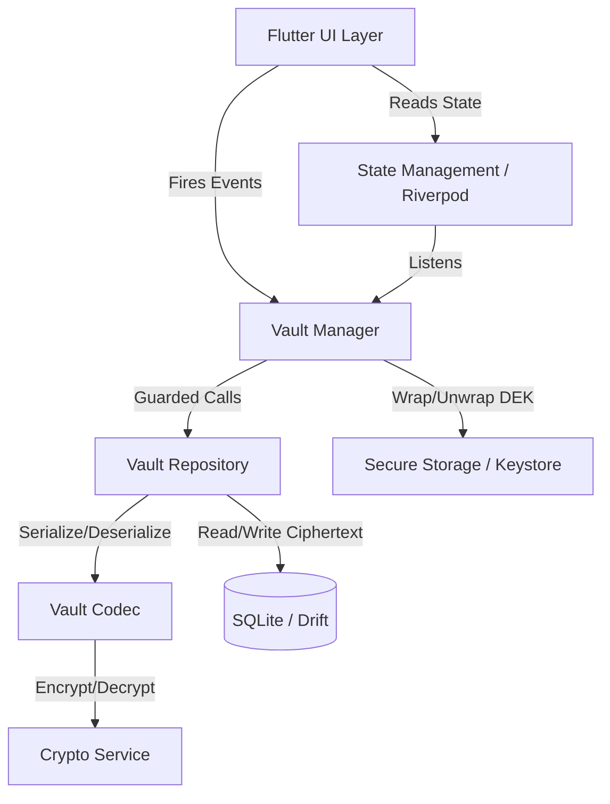
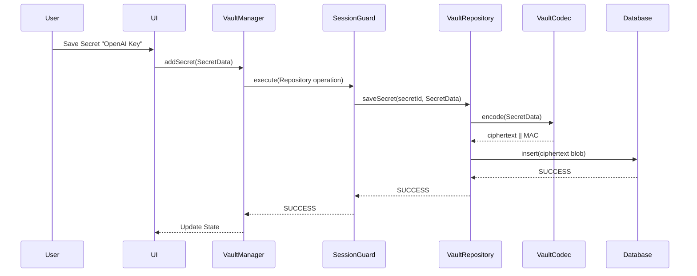
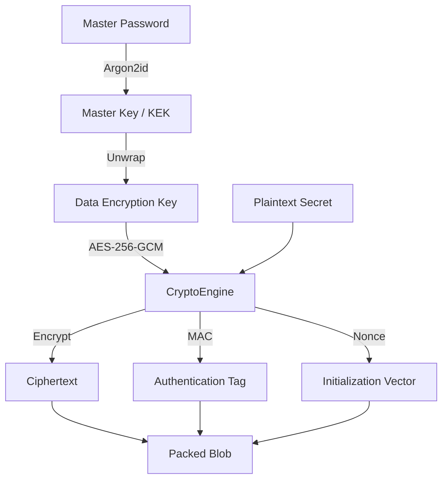
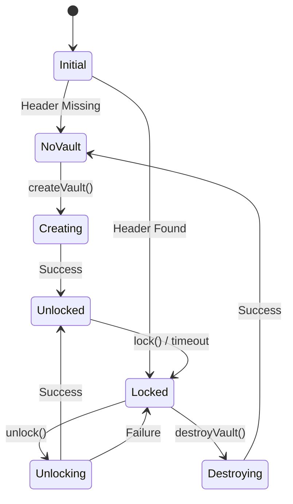
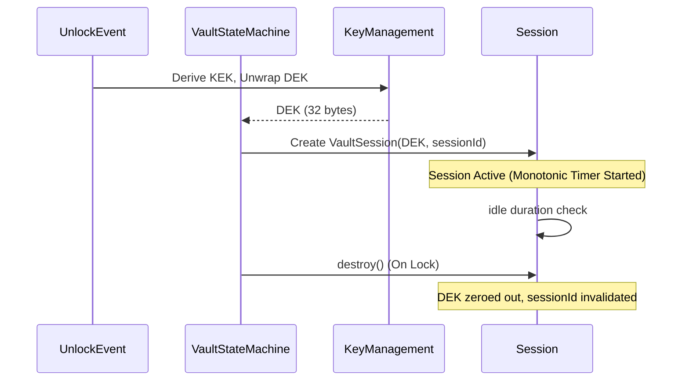

> **"API Vault favors correctness over convenience, explicitness over cleverness, and verified guarantees over assumed safety."**

# API Vault
**Offline-first Developer Security Hub**


API Vault is an offline-first mobile application that securely stores API keys, tokens, certificates, SSH keys, and developer secrets using modern cryptography. Built for developers, cybersecurity professionals, DevOps engineers, students, and security-conscious teams, API Vault is designed around a single absolute truth: **your secrets belong to you, and no one else.**

Privacy is our default, not a setting. 
- No cloud.
- No telemetry.
- No analytics.
- No accounts.
- No hidden network calls.

API Vault is not merely a password manager. It is a verified cryptographic engine packaged into a developer utility.

---

## Table of Contents
1. [Core Principles](#core-principles)
2. [Tech Stack](#tech-stack)
3. [Architecture](#architecture)
4. [Cryptography](#cryptography)
5. [Security Guarantees](#security-guarantees)
6. [Security Assumptions](#security-assumptions)
7. [Non-Goals](#non-goals)
8. [Features](#features)
9. [Project Structure](#project-structure)
10. [Engineering Philosophy](#engineering-philosophy)
11. [Testing](#testing)
12. [Documentation](#documentation)
13. [Roadmap](#roadmap)
14. [Contributing](#contributing)

---

## Core Principles

Every line of code in API Vault answers to these principles.

### Privacy First
Data is a liability. We do not collect it. There are no tracking scripts, crashlytics, or product analytics embedded in this application. Your usage patterns, secret names, and vault frequency are entirely your own business. 

### Offline First
API Vault does not require an internet connection to operate. The core cryptographic engine and the SQLite database operate entirely on local device storage. The network stack is intentionally starved to prevent accidental data exfiltration.

### Zero Trust Architecture
We assume that the device operating system, the user's physical environment, and the application runtime are hostile. API Vault does not trust the OS Keystore exclusively; it relies on its own robust encryption lifecycle to ensure survival and integrity even if the device's hardware-backed keystore is purged.

### Defense in Depth
Security is not a single layer. API Vault utilizes multiple, overlapping mechanisms to protect data. If a session leaks, the state machine forcibly locks. If the UI is backgrounded, it immediately blurs. If the device is locked, memory pointers to the decryption keys are explicitly severed.

### Least Privilege
Repositories are strictly isolated from cryptographic primitives. The Data Access Objects (DAOs) only know about ciphertext blobs. The UI only knows about decrypted domain models. `SessionGuard` ensures that no component can self-authorize access to secrets.

### Verified Guarantees
We do not say "we believe this is secure." We say "we verified this is secure." API Vault operates on verifiable invariants. If a change breaks an invariant, the build fails. See the `Verification_Report.md` for our ongoing ledger of proof.

### Open Source
Security through obscurity is fragility. API Vault is fully open source. We invite the security community to audit, break, and challenge our assumptions.

### No Telemetry
There is no telemetry. Period. No "opt-in," no "anonymous usage statistics." Nothing leaves the device.

### Security by Default
There are no "convenient but insecure" configurations. Argon2id runs at strict parameters. AES-GCM runs with strict tag validation. You cannot disable the cryptographic validation to make the app "faster."

---

## Tech Stack

The technology choices in API Vault are intentionally boring and fiercely reliable. 

* **Flutter**: Cross-platform UI toolkit providing deterministic, state-driven rendering.
* **Riverpod**: Compile-safe, reactive state management to prevent dangling state anomalies.
* **GoRouter**: Declarative routing architecture that forces state-based navigation rather than imperative pushes.
* **Drift (formerly Moor)**: Type-safe SQL database builder for Dart, ensuring schema guarantees at compile time.
* **SQLite (via sqlite3_flutter_libs)**: The most battle-tested, offline-first relational database in the world.
* **Argon2id**: Memory-hard, CPU-hard key derivation function (KDF) that resists GPU cracking.
* **AES-256-GCM**: Authenticated encryption with associated data (AEAD). The gold standard for symmetric encryption.
* **Android Keystore / iOS Keychain**: Hardware-backed secure storage utilized for biometric key-wrapping.
* **Freezed**: Immutable data classes and pattern matching.
* **json_serializable**: Code-generated, type-safe JSON encoding/decoding.

---

## Architecture

API Vault is designed using a strict separation of concerns. Cryptography never touches the UI, and the UI never touches the database. 

### High-Level Architecture



### Data Flow



### Encryption Flow



### Vault Lifecycle & State Machine



### Session Lifecycle



---

## Cryptography

The cryptography in API Vault is explicitly designed to minimize the impact of password compromise and facilitate rapid data management.

### Key Hierarchy

1. **Master Password**: The user's secret.
2. **Key Encryption Key (KEK) / Master Key**: Derived from the Master Password using **Argon2id**. This derivation is intentionally slow and memory-hard to defeat offline brute-force attacks.
3. **Data Encryption Key (DEK)**: A securely generated 32-byte key created once during Vault creation. The DEK is responsible for encrypting all actual data inside the vault.

### Why a DEK?
We never encrypt secrets directly with the Master Key. By encrypting the database with a DEK, and then wrapping the DEK with the Master Key, we allow the user to **change their Master Password** instantly. When a password is changed, we simply unwrap the DEK using the old KEK, and re-wrap it with a new KEK derived from the new password. The thousands of secrets in the SQLite database never need to be re-encrypted.

### Two Unlock Modes (ADR-010)

API Vault ensures survival independent of the OS Keystore by strictly maintaining **ONE Canonical DEK** with two wrapping modes.

**Mode A: Password Unlock**
```
Master Password → Argon2id → Master Key → Unwrap DEK from VaultHeaders (SQLite)
```

**Mode B: Biometric Unlock**
```
Hardware Keystore (Biometric) → Retrieve Wrapped DEK → Session
```
If the OS Keystore is cleared (e.g., changing device PIN), Mode B breaks, but the vault survives because Mode A relies on the SQLite `VaultHeaders`.

### Authenticated Encryption
API Vault uses **AES-256-GCM**. This provides both confidentiality and integrity. The cipher outputs a ciphertext and a Message Authentication Code (MAC) tag. If a single bit of the database is corrupted or tampered with, the MAC validation will fail during decryption, and API Vault will refuse to return tampered data.

### Secure Randomness
Predictability is the enemy of cryptography. API Vault explicitly bans `dart:math` `Random()` for cryptographic operations. `SecureRandomService` leverages the cryptographically secure pseudo-random number generator (CSPRNG) provided by the operating system.

---

## Security Guarantees

We operate on explicit, verified invariants. Every Pull Request must prove it does not break these guarantees.

* **INV-001**: Secrets (payload, name, or metadata) are NEVER written to persistent storage in plaintext.
* **INV-002**: Sessions never survive a lock. Calling `lock()` destroys the DEK in memory immediately.
* **INV-003**: Repositories never access plaintext without `SessionGuard`. Repositories cannot self-authorize.
* **INV-004**: `VaultCodec` exclusively owns serialization. Repositories do not touch bytes.
* **INV-005**: Only `CryptoService` performs encryption. No raw cryptographic primitive calls exist elsewhere.
* **INV-006**: Only `VaultManager` changes lifecycle states. No boolean soup (`isUnlocked`).
* **INV-007**: Only `SecureRandomService` generates entropy.
* **INV-008**: Audit logs and debug prints NEVER serialize secret domains.
* **INV-009**: Clipboard interactions are temporarily leased and automatically cleared based on monotonic time.
* **INV-010**: Backgrounding the app instantly obscures the UI. Extended backgrounding automatically locks the vault.
* **INV-015**: Every repository operation executes inside exactly one transaction.
* **INV-017**: Every unlock produces a mathematically new `sessionId`.

---

## Security Assumptions

Security software does not exist in a vacuum. API Vault relies on the following environmental assumptions:

1. **Android Keystore / iOS Keychain Integrity**: Hardware-backed keys are properly isolated by the OS/TEE.
2. **Cryptographic Primitives**: `AES-256-GCM` and `Argon2id` are mathematically sound.
3. **Application Sandboxing**: The OS prevents other apps from reading API Vault's memory or private app directory.
4. **Managed Runtime Limitations**: Dart is a garbage-collected language. While we explicitly dereference keys, immutable string copies may briefly persist in OS swap space or uncollected memory.
5. **Rooted / Jailbroken Devices**: A rooted device compromises OS sandboxing. An attacker with root can dump memory and intercept the master password.
6. **Weak Passwords**: Argon2id mitigates weak passwords, but a sufficiently weak password ("password123") is vulnerable to dictionary attacks if the vault file is extracted.

---

## Non-Goals

To maintain a secure perimeter, API Vault explicitly rejects feature creep. API Vault will **NEVER** become:

* A cloud-synced password manager.
* A browser autofill provider (this exposes vault access to web surfaces).
* An analytics tracking platform.
* An IDE or source-code editor.
* An active API gateway or proxy.

---

## Features

### Current
- [x] Cryptographic Engine (AES-256-GCM, Argon2id)
- [x] Vault Lifecycle (Create, Lock, Unlock, Destroy)
- [x] Secure SQLite Persistence (Drift)
- [x] Hardware-backed Biometric Key Wrapping
- [x] Strict Session isolation via `SessionGuard`

### Planned
- [ ] Developer-friendly categorization (Tokens, SSH Keys, Configs)
- [ ] Blind Indexing for extremely fast, secure search of encrypted data
- [ ] Export/Import encrypted backups
- [ ] Built-in Security Dashboard and Posture Overview

### Future
- [ ] Local Wi-Fi Sync (Device to Device, no cloud)
- [ ] Expiry alerts for short-lived credentials

### Never
- [ ] Cloud synchronization through third-party servers
- [ ] Plaintext exports without severe warnings

---

## Project Structure

```text
lib/
├── app/               # Flutter application entry, Providers, routing
├── core/              # Infrastructure and strict abstractions
│   ├── crypto/        # AES, Argon2id, Key Management, Randomness
│   ├── errors/        # Typed failure states
│   ├── storage/       # SQLite database, DAOs, Migrations
│   └── vault/         # The Vault Engine: Managers, Repositories, Codecs, State
├── features/          # UI layer, organized by user journey (e.g., auth, settings)
└── shared/            # Reusable UI widgets and design tokens

docs/
├── adr/               # Architecture Decision Records
└── Verification_Report.md
```

### Module Responsibilities
- `core/crypto`: Strictly responsible for byte-level math. Knows nothing about databases.
- `core/storage`: Strictly responsible for persisting binary blobs. Knows nothing about plaintext.
- `core/vault`: The orchestrator. Combines cryptography and storage to enforce invariants.

---

## Engineering Philosophy

### Architecture Decision Records (ADRs)
Every major technical decision is documented in `docs/adr/`. We do not rely on oral history. If a dependency is added, an ADR explains why it was chosen and what alternatives were rejected.

### Invariant-Driven Engineering
We define strict architectural invariants (e.g., "Repositories never bypass encryption"). These invariants dictate code review. A PR is only accepted if it explicitly lists which invariants it preserves and proves it does not violate them.

### Evidence Over Assumptions
We do not trust our own code. We rely on the `Verification_Report.md`, supported by heavy integration and stress testing, to prove the software works under adversarial conditions.

### Regression-First Bug Fixing
If a bug is discovered:
1. File a report.
2. Identify the root cause.
3. Write a regression test that fails.
4. Fix the bug.
5. Verify the test passes.

### Performance Budgets
Security cannot be an excuse for sluggishness. Unlock operations must complete in `< 500ms`. Encrypting a standard payload must take `< 10ms`. If an update breaches the performance budget, it is treated as a failed build.

---

## Testing

API Vault employs a brutal, multi-tiered testing strategy.

### Test Suites
1. **Unit Tests**: Validates individual classes and pure logic (e.g., `VaultCodec`).
2. **Integration Tests**: Validates the `UI -> Manager -> Repository -> Storage` flow.
3. **Stress Tests**: Runs the lifecycle (Create -> Lock -> Unlock) 10,000 times looking for memory leaks or dangling transactions.
4. **Property-Based Testing**: Validates that `decode(encode(payload)) == payload` across thousands of randomized inputs, emojis, sizes, and malformed strings.
5. **Red Team Tests**: Actively attempts to bypass security constraints (e.g., password spraying, truncating the database, tampering with MACs, interrupting transactions).
6. **Chaos Mode (Planned)**: A compile-time flag that randomly injects latency, throws exceptions, and simulates full storage to uncover race conditions.

### Engineering Confidence Index (ECI)
API Vault tracks an overarching ECI score based on invariant coverage, stress test pass rates, red team survival, and performance budgets. If the ECI drops, all feature development halts until confidence is restored.

---

## Documentation

API Vault is exhaustively documented. See the `docs/` directory.

- **ADR-008: Key Hierarchy**: Explains KEK and DEK structures.
- **ADR-009: Search Architecture**: Details blind indexing strategy.
- **ADR-010: Recovery Strategy**: Defines Mode A and Mode B unlock mechanics.
- **ADR-011: Security Invariants**: Lists the absolute rules of the codebase.
- **Verification_Report.md**: The live evidence ledger proving stress test survivability.
- **RELEASE_CHECKLIST.md**: The unskippable 15-point release gate.
- **THREATS_NOT_ADDRESSED.md**: Explicit boundaries of the threat model.
- **SECURITY_ASSUMPTIONS.md**: Environmental dependencies.
- **Technical_Debt_Register.md**: Tracked compromises and planned resolutions.

---

## Roadmap

| Phase | Description | Status |
| ----- | ----------- | ------ |
| **Phase 0** | Architecture Freeze, Documentation, ADRs | ✅ |
| **Phase 1** | Project Infrastructure & SQLite setup | ✅ |
| **Phase 2** | Vault Engine & Cryptographic Core | ✅ |
| **Phase 3** | Red Team Verification & Stress Testing | 🔄 In Progress |
| **Phase 4** | Developer UI & UX Polish | ⏳ Pending |
| **Phase 5** | Blind Index Search & Export Tools | ⏳ Pending |

---

## Contributing

We welcome contributions, but we enforce an uncompromising standard for code quality. 

**Contribution Rules:**
1. **No architectural shortcuts.** If you bypass `SessionGuard`, your PR will be rejected.
2. **Preserve invariants.** Every PR must state which invariants it touches.
3. **Write regression tests.** No bug fix is accepted without a corresponding failing test.
4. **Green CI is mandatory.** Analyze must be clean. Tests must pass.
5. **No plaintext logging.** Audit logging must never contain secret domains.
6. **Justify dependencies.** Every new package requires an architectural justification. 

API Vault's main branch is protected. It is always releasable.

---

## License

API Vault is released under the **MIT License**.

> *Build with discipline. Verify with evidence.* 🔐
